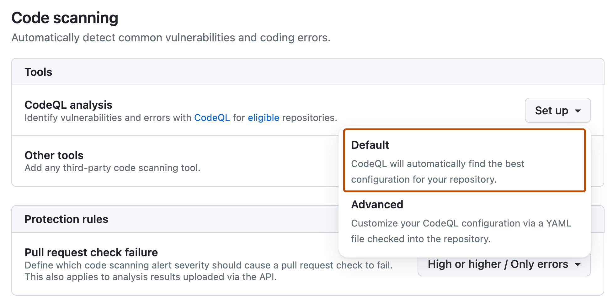
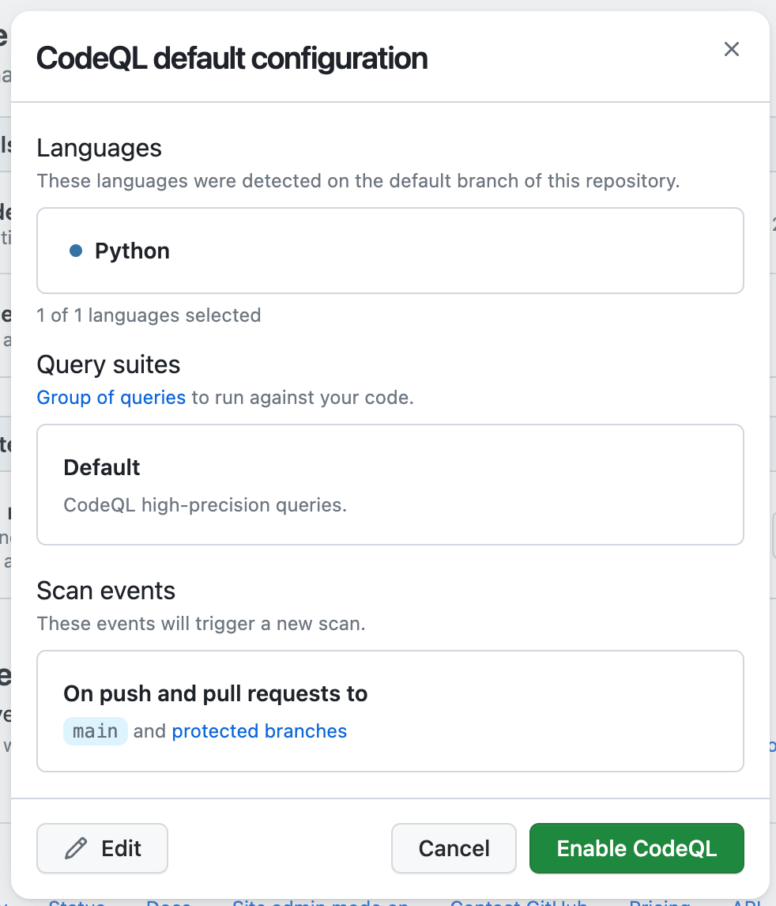
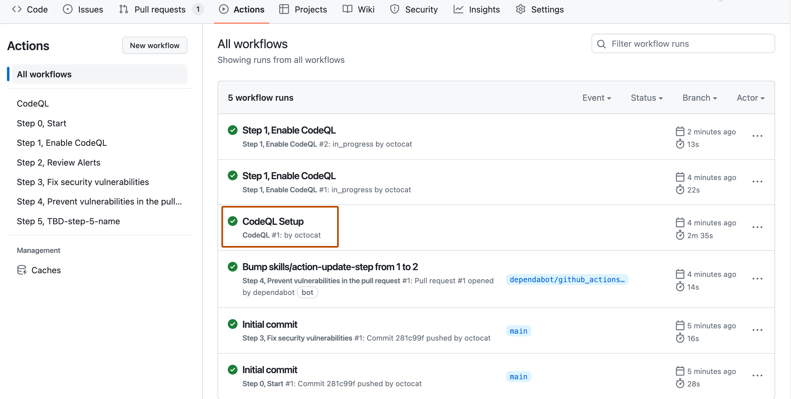
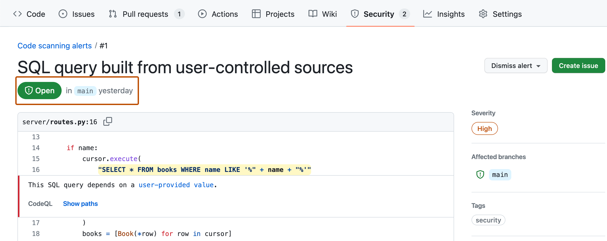
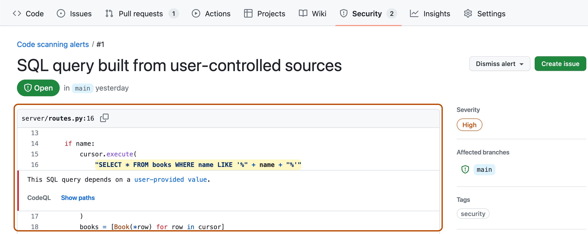
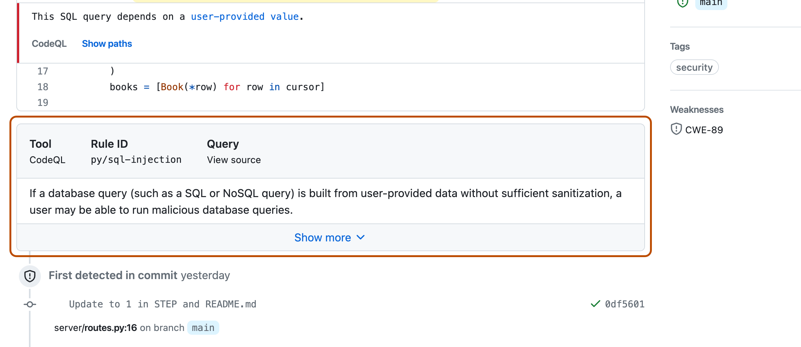
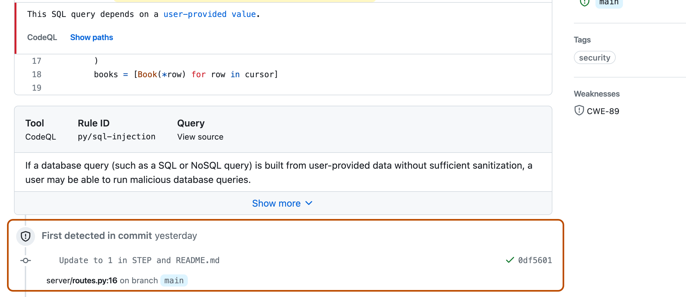
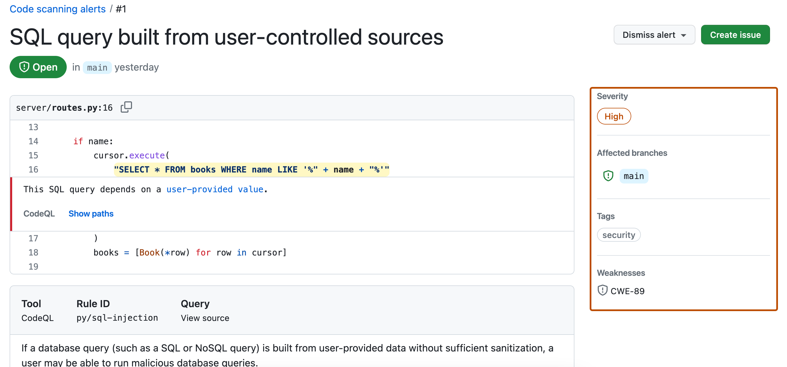
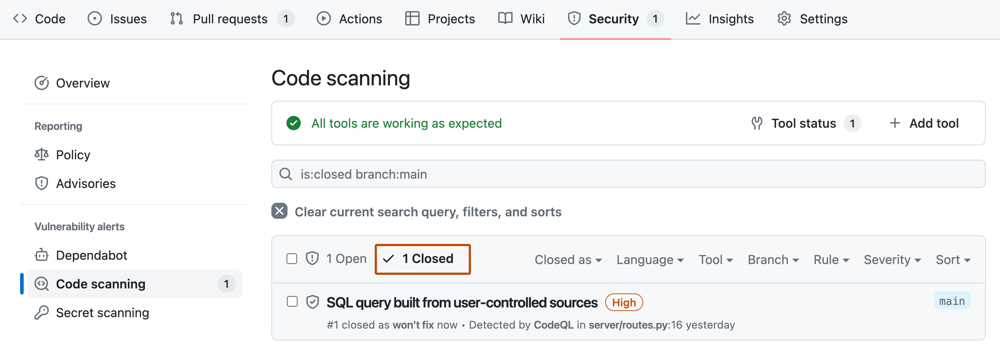
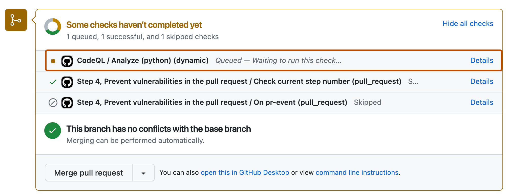

<!--
  <<< Author notes: Header of the course >>>
  Read <https://skills.github.com/quickstart> for more information about how to build courses using this template.
  Include a 1280×640 image, course name in sentence case, and a concise description in emphasis.
  In your repository settings: enable template repository, add your 1280×640 social image, auto delete head branches.
  Next to "About", add description & tags; disable releases, packages, & environments.
  Add your open source license, GitHub uses the MIT license.
-->

# Secure Your Repository Source Code 

Ensuring the security of application source code is a critical step in modern software development.  In this GitHub Skills course, you will learn to use GitHub code scanning to identify, resolve, and prevent insecure coding patterns.

<!--
  <<< Author notes: Start of the course >>>
  Include start button, a note about Actions minutes,
  and tell the learner why they should take the course.
  Each step should be wrapped in 
/
, with an `id` set.
  The start 
 should have `open` as well.
  Do not use quotes on the 
 tag attributes.
-->

<h2>Welcome</h2>

👋 Hello! Welcome to the GitHub Skills course: Secure Your Repository Source Code! In this course, we will explore using GitHub code scanning, powered by [CodeQL](https://codeql.github.com/), to identify common coding practices that can lead to security vulnerabilities. During this course, we will enable code scanning on your repository to identify, remediate, and prevent vulnerabilities.
  
Code scanning is part of the [GitHub Advanced Security (GHAS)](https://docs.github.com/en/get-started/learning-about-github/about-github-advanced-security) product suite. All of the features of Advanced Security are 100% free for open source, public repositories.

- **Who is this for**: Developers, security engineers, open source maintainers.
- **What you'll learn**: We'll show you how to enable code scanning and identify SQL injection vulnerabilities with CodeQL.
- **What you'll build**: A secure software development pipeline that allows you to identify and prevent new security vulnerabilities from being introduced into your production code.
- **Prerequisites**: In this course, you'll need a baseline knowledge of GitHub concepts such as pull requests, GitHub Actions, and source code. You'll also need to be familiar with the concepts of Static Application Security Testing (SAST). Don't worry, we'll demistify the complex parts for you 🙂.
- **How long**: This course is four steps long and takes less than 30 minutes to complete.

## How to start this course

<!-- For start course, run in JavaScript:
'https://github.com/new?' + new URLSearchParams({
  template_owner: 'TBD-organization',
  template_name: 'TBD-course-name',
  owner: '@me',
  name: 'TBD-organization-TBD-course-name',
  description: 'My clone repository',
  visibility: 'public',
}).toString()
-->

1. Right-click **Start course** and open the link in a new tab.
2. In the new tab, most of the prompts will automatically fill in for you.
   - For owner, choose your personal account or an organization to host the repository.
   - We recommend creating a public repository, as private repositories will [use Actions minutes](https://docs.github.com/en/billing/managing-billing-for-github-actions/about-billing-for-github-actions).
   - Scroll down and click the **Create repository** button at the bottom of the form.
3. After your new repository is created, wait about 20 seconds, then refresh the page. Follow the step-by-step instructions in the new repository's README.

<!--
  <<< Author notes: Step 1 >>>
  Choose 3-5 steps for your course.
  The first step is always the hardest, so pick something easy!
  Link to docs.github.com for further explanations.
  Encourage users to open new tabs for steps!
  TBD-step-1-notes.
-->

<h2>Step 1: Enable CodeQL</h2>

👋 Hello! Welcome to the GitHub Skills course: Secure Your Repository Source Code! 

Let's get started!  

In this first step, we'll be learning more about CodeQL and how to use it to secure your source code. 

**What is GitHub code scanning**: _[Code scanning](https://docs.github.com/en/code-security/code-scanning/automatically-scanning-your-code-for-vulnerabilities-and-errors/about-code-scanning)_ is a capability that allows development teams to integrate security testing tools into the software development process. This is done using GitHub Actions. With code scanning, you can integrate many different types of tools including SAST, container, and infrastructure as code security tools.

**What is CodeQL**: _[CodeQL](https://docs.github.com/en/code-security/code-scanning/automatically-scanning-your-code-for-vulnerabilities-and-errors/about-code-scanning-with-codeql)_ is a static analysis testing tool that helps you identify security weaknesses such as SQL injection, cross-site scripting, and code injection issues.

### :keyboard: Activity: Enable code scanning with CodeQL
  
First, we will enable code scanning with CodeQL in our repository.

1. Open a new browser tab, and work on the steps in your second tab while you read the instructions in this tab.
2. Navigate the to **Settings** tab at the top of your newly created repository.
3. Under the **Security** section on the left side, select **Code security and analysis**.
4. Scroll down to the section titled **Code scanning**. For the purpose of this course, we will focus on CodeQL analysis.
5. Click on the **Set up** dropdown menu and choose **Default**.

Let's take a look at the configuration options in the modal:
  
  - **Languages to analyze:** These are the languages that will be scanned by CodeQL. In this case, we will be scanning in `Python`.  
  - **Query suites:** CodeQL [queries](https://docs.github.com/en/code-security/code-scanning/automatically-scanning-your-code-for-vulnerabilities-and-errors/about-code-scanning-with-codeql#about-codeql-queries) are packaged in bundles called "suites". This section allows you to choose which query suite to use.  We'll leave this set as **Default** for this exercise. For more information, see "[About CodeQL queries](https://docs.github.com/en/code-security/code-scanning/automatically-scanning-your-code-for-vulnerabilities-and-errors/about-code-scanning-with-codeql#about-codeql-queries)." 
  - **Events:** This section tells CodeQL when to scan. In this case, it's set to scan on any pull request to the `main` branch.
    

6. Click **Enable CodeQL**
7. Wait about 20 seconds then refresh this page for the next step.

<!--
  <<< Author notes: Step 2 >>>
  Start this step by acknowledging the previous step.
  Define terms and link to docs.github.com.
  TBD-step-2-notes.
-->

<h2>Step 2: Review and Triage CodeQL Alerts</h2>

_Way to go! You got CodeQL running! :tada:_

In this exercise, we'll review the CodeQL scan results, triage an alert, and create a GitHub issue to track an alert.

**What is GitHub Actions**: GitHub Actions is the automation and CI/CD platform within GitHub. We use GitHub Actions to orchestrate and execute security scans with code scanning. GitHub Actions is a continuous integration and continuous delivery (CI/CD) platform that allows you to automate your build, test, and deployment pipeline. For more information on GitHub Actions, see "[Understanding GitHub Actions](https://docs.github.com/en/actions/learn-github-actions/understanding-github-actions)."

**What is CWE**: Common Weakenss Enumeration (CWE) is a category system for hardware and software weaknesses and vulnerabilities. Think of it as a way to describe and categorize security issues in an application's source code. For more information on CWEs, see the Wikipedia article "[Common Weakness Enumeration](https://en.wikipedia.org/wiki/Common_Weakness_Enumeration)."

### :keyboard: Activity 1: View the status of a CodeQL scan

In this activity, we'll explore GitHub Actions to view the status of a CodeQL scan.  
1. In your new repository, go to your Actions page by selecting **Actions** from the top navigation bar. If the CodeQL Action run is still executing, you will see a yellow spinner indicating the scan is still in progress. This typically takes about 4 minutes to complete.
2. Select the run by clicking on **CodeQL Setup**.

Notice that more information is available inside the Actions run. Feel free to explore this section to view information such as the CodeQL logs, duration, status, and artifacts generated by CodeQL.

Once the scan is complete, a green check will show next to the execution.  
  
### :keyboard: Activity 2: View all CodeQL Alerts

In this activity, we will view the CodeQL findings in the Security page of your repository. The Security page is where all security related information is displayed. 

1. Navigate to the **Security** tab in the top navigation bar of your repository.  
2. Select **Code scanning** under the "Vulnerability alerts" heading in left-side navigation bar.

This screen will contain all the vulnerabilities identified by CodeQL inside this repository's codebase. Explore the different filters and search capabilities in this page. These filtering capabilities become very helpful when you're working with many findings!

### :keyboard: Activity 3: Review an Alert

In this activity, we will explore the alert UI. We'll review the data flow of the vulnerability, indentify what part of the code the alert impacts, and get more information about the alert.

**Alert status:** This section displays the current alert status (open or closed), identifies the branch where the scan detected the alert, and shows the timestamp of the alert.
  

**Location information:** This section describes which part of the code is vulnerable.  
  

**Paths:** Clicking on "Show paths" will give you additional insights into the alert's data flow. The modal shows us where the user input (we call that a "source") flows through the application until it's acted on (we call this the "sink"). This visualizes the flow of data through your application. 
  
**Recommendations:** This section provides a quick overview of the tool (CodeQL in this case), Rule ID, and even allows you to view the CodeQL query used to find this vulnerability. You can view the query by clicking **View source**. Additionally, this pane includes recommendations for fixing this vulnerability. Click **Show more** to view the full recommendation.

**Audit trail:** The audit trail shows the history of the alert. This trail will show the status as users mark an alert as closed or fix an alert in the code.

**Alert triage:** Use the buttons at the top right of the alert to triage or create a new issue for the alert. Don't do anything yet. We'll get into these buttons in a moment. 😄

**Additional info:** Finally, the right-side panel contains information such as tags, CWE information, and the severity of the alert
  

### :keyboard: Activity 4: Dismiss an Alert
Now that we're familiar with the alert layout, let's work through the process of closing one.

1. Inside this same alert, click **Dismiss alert**, choose any reason for dismissal, and add a short note.
2. Click **Dismiss alert**.
3. At this point, the alert will change its state to "Dismissed". You can now see the change you made in the audit trail at the bottom of the alert.
4. Navigate back to **Security** > **Code scanning alerts**.  You'll see that you only have 1 alert listed.
5. Click **1 Closed**.  This will bring you to the closed alerts where you can view the alert you just closed.
   

7. (Optional) You can also reopen the alert by opening it, then selecting **Reopen alert**.

### :keyboard: Activity 5: Create a GitHub Issue for an Alert
This last step will show you how to create a GitHub Issue to track the work that goes into resolving a vulnerability. Issues provide a space for collaboration for a security problem and can be assigned to people or teams.
  
1. Open one of the open alerts that CodeQL from the scan.  
2. Click the green **Create issue** button at the top right of the alert. If you don't see this button, check the status of the alert to make sure it's an open alert.
3. Add any details you would like to include in the new issue form.  
4. Click **Submit new issue**.
5. To view the your issue, click **Issues** in the top navigation bar of your repository.
6. Wait about 20 seconds then refresh this page for the next step.
  

<!--
  <<< Author notes: Step 3 >>>
  Start this step by acknowledging the previous step.
  Define terms and link to docs.github.com.
  TBD-step-3-notes.
-->

<h2>Step 3: Fix Security Vulnerabilites</h2>

_Nice work finishing Step 2: Reviewing and Triaging CodeQL Alerts :sparkles:_
  
In this step, we will work to fix the existing security vulnerabilities already identified by CodeQL. Remember, at this point, we have introduced CodeQL into our repository and had it scan the existing code. The vulnerabilities it found are real-world issues, and they need to be fixed! We'll fix this issue by editing the `/server/routes.py` file.  

### :keyboard: Activity 1: Review alerts
First, before we fix these alerts, we need to make sure the alerts are still open. We'll also need to gather information on which files to fix and how best to fix them.

1. Navigate to your code scanning alerts page: **Security** > **Code scanning**. 
1. You should see two alerts listed as "**Open**". If any of the alerts are listed as "**Closed**", open the alert page and choose **Reopen alert**.

Now that both of these alerts are open, let's fix them. If you look at the alerts, they both call out one specific file containing the issues: `server/routes.py`. The issue is in crafting the SQL query for the database. These queries are vulnerable to SQL injection attacks. We should rewrite these SQL statements more securely. 
  
If you expand the **More info** section at the bottom of the alert, there are very clear suggestions to fix this query. We're going to implement those suggestions in the next activity.

### :keyboard: Activity 2: Edit routes.py
We now know where the issues exist and how to fix them. We'll start by modifying the file `routes.py`. Again, you'll want to do these next steps in a separate browser window or tab.
  
1. Click the **Code** tab in your repository.
2. Select the `server` folder.
3. Select the `routes.py` file.
4. Click the **Edit** button to the right.
  
  
  
5. Edit line 16 by highlighting the SQL statement and replace it with this text: `"SELECT * FROM books WHERE name LIKE %s", name`.
  
6. Edit line 22 to replace the SQL statement with this text: `"SELECT * FROM books WHERE author LIKE %s", author`.
  
7. Click **Commit changes...** from the top right. The "Propose changes" window will pop up. Leave the defaults configured, and click **Commit changes** again.
8. CodeQL will now initiate a new scan. Check the status of that scan by navigating to **Actions** then choose the **CodeQL** action. Once the scan job completes, Actions will display a green check next to the last run.
9. Once that CodeQL scan is done, navigate to **Security** > **Code scanning** to review the alerts. You should have zero open alerts and two closed alerts 🎉. Feel free to review the closed alerts, especially the audit trail.  
10. Wait about 20 seconds then refresh this page for the next step.
  

<!--
  <<< Author notes: Step 4 >>>
  Start this step by acknowledging the previous step.
  Define terms and link to docs.github.com.
  TBD-step-4-notes.
-->

<h2>Step 4: Prevent Vulnerabilities in the Pull Request</h2>

_Nicely done! You finished Step 3: Fix Security Vulnerabilites! :partying_face:_

Way to go! You made it this far. We're almost done! The last step is to test out the pull request integration with CodeQL. In this step, we will add a vulnerability back into the `routes.py` file to trigger an alert for a SQL injection vulnerability. This is going to be the same issue initially saw.  
  
Our goal is to understand what developers experience when they find a new vulnerability.  

In this step, we will:
- edit the `routes.py` file.
- change the SQL statement to make it insecure.
- commit those changes and merge the insecure code into the main branch.
- experience the alert inside the pull request.
  
Let's get started 👍

**What is pull request**: Pull requests are proposed changes to a repository submitted by a user and accepted or rejected by a repository's collaborators. This allows multiple people to work on the same code at the same time. For more information, check out the GitHub Skills course "[Introduction to GitHub](https://github.com/skills/introduction-to-github)" or "[About pull requests](https://docs.github.com/en/pull-requests/collaborating-with-pull-requests/proposing-changes-to-your-work-with-pull-requests/about-pull-requests)" from the GitHub docs.

**What is branch**: A branch is a parallel version of your repository. By default, your repository has one branch named main and it is considered to be the definitive branch. Creating additional branches allows you to copy the main branch of your repository and safely make any changes without disrupting the main project. For more information, see "[About branches](https://docs.github.com/en/pull-requests/collaborating-with-pull-requests/proposing-changes-to-your-work-with-pull-requests/about-branches#)" in the GitHub docs.

### :keyboard: Activity 1: Edit `routes.py` and create a new pull request

In this first activity, we'll introduce the same insecure SQL statement from before to the `routes.py` file. Once we update the file, we'll commit it to a new branch, then create a pull request.

  1. Click the **Code** tab in your repository.
  2. Select the `server` folder.
  3. Select the `routes.py` file.
  4. Click the **Edit** button to the right.

  
  5. Edit line 16 by highlighting the SQL statement and replace it with this text: `"SELECT * FROM books WHERE name LIKE '%" + name + "%'"`.
  6. Click **Commit changes...** from the top right. The "Propose changes" window will pop up.
  7. This time, select the radio button next to **Create a new branch**. You can create a new name for this branch or leave it as the default suggestion.
  8. Click **Propose changes**. This opens a new pull request.
  9. In the "Open a pull request" window, click **Create pull request**.
  

### :keyboard: Activity 2: Review pull request

At this point, we've edited the file `routes.py` to add our vulnerable code, committed those changes to our new branch, and created a pull request to merge the new branch into our `main` branch. These are the same steps a developer would take to introduce new, vulnerable code into a repository. 
  
Now, let's take a look at the pull request to see what the experience is like.
  
1. In the previous activity, we created the pull request.  After creating the pull request, you were brought directly to the pull request page. At the bottom of the pull request, you will see a check called "Code scanning/CodeQL". This is the CodeQL analysis job scanning the code introduced in the pull request.

2.  Once the check is complete, you will see a new comment in the pull request from CodeQL indicating a new security vulnerability; a SQL query built from user-controlled data. This is our SQL injection vulnerability.
  
  

3. Review the data flow paths by clicking **Show paths**.
  
4. If you would like, add a comment and tag one of your friends by using their GitHub handle (example: `@username`). This will notify them that you made a comment on the issue and need their help solving the problem. 😄

5. Wait about 20 seconds then refresh this page for the next step.

If this were a real-world situation, the developer would fix the SQL statement in their branch. Once fixed, the vulnerability will automatically close out.

If you would like to learn more about pull request integrations for code scanning, see "[Triaging code scanning alerts in pull requests](https://docs.github.com/en/code-security/code-scanning/automatically-scanning-your-code-for-vulnerabilities-and-errors/triaging-code-scanning-alerts-in-pull-requests)."

<!--
  <<< Author notes: Finish >>>
  Review what we learned, ask for feedback, provide next steps.
-->

<h2>Finish</h2>

_Congratulations! You have completed this course!_ 🏆

Here's a recap of all the tasks you accomplished in your repository:
  - Enabled CodeQL on your repository.
  - CodeQL scanned the code in your repository and notified us of two SQL injection vulenrabilities.
  - Reviewed the findings, marked the findings as closed, and explored the audit trail.
  - Fixed your code in the main branch and saw that the findings automatically closed out.
  - Introduced a new vulnerability in a new branch.
  - Created a pull request, and were notified of the vulnerability.

### What's next?

- Continue your learning! Our [code scanning documentation](https://docs.github.com/en/code-security/code-scanning/automatically-scanning-your-code-for-vulnerabilities-and-errors/about-code-scanning) is a great resource for learning more about CodeQL.
- Learn more about CodeQL. Take a look at the [CodeQL documenation](https://codeql.github.com/docs/) site to learn about all of the features of this powerful tool.
- [We'd love to hear what you thought of this course](TBD-feedback-link).
- [Take another TBD-organization Course](https://github.com/TBD-organization).
- [Read the GitHub Getting Started docs](https://docs.github.com/en/get-started).
- To find projects to contribute to, check out [GitHub Explore](https://github.com/explore).

<!--
  <<< Author notes: Footer >>>
  Add a link to get support, GitHub status page, code of conduct, license link.
-->

---

Get help: [TBD-support](TBD-support-link) &bull; [Review the GitHub status page](https://www.githubstatus.com/)

&copy; 2023 TBD-copyright-holder &bull; [Code of Conduct](https://www.contributor-covenant.org/version/2/1/code_of_conduct/code_of_conduct.md) &bull; [MIT License](https://gh.io/mit)
